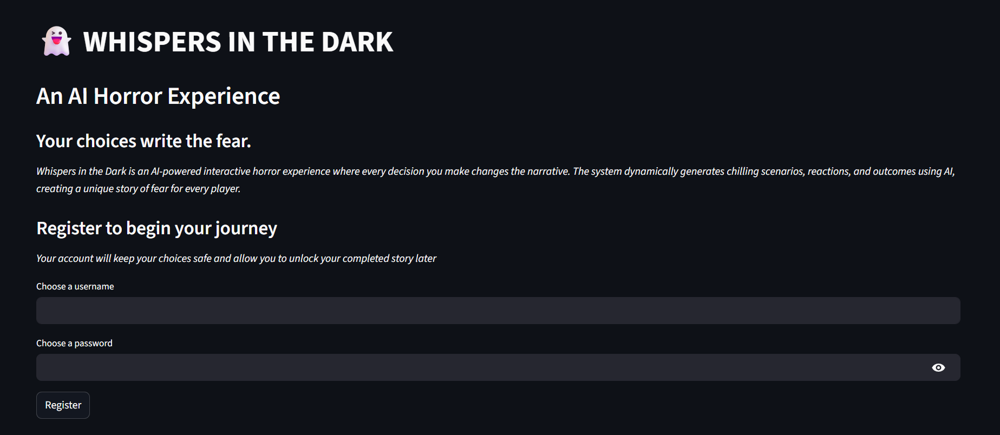
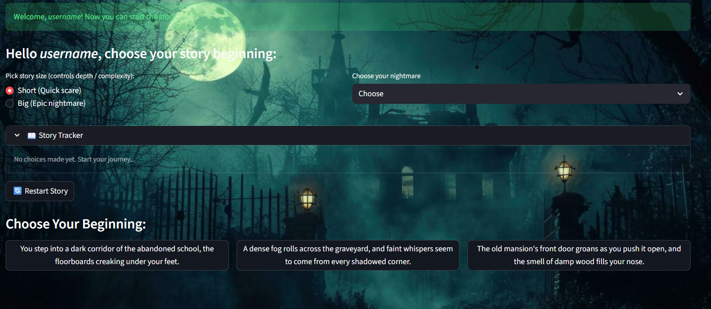
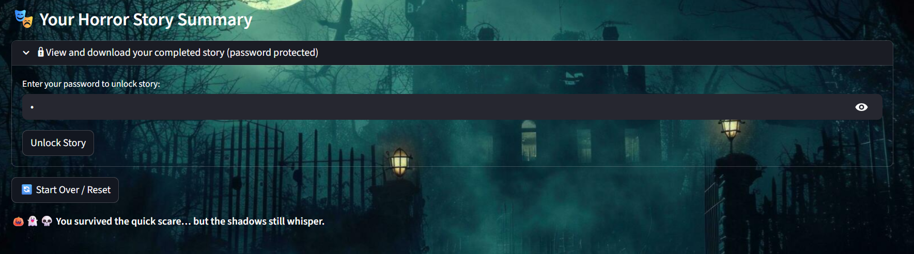

# 👻 Whispers in the Dark — An AI Horror Experience

**🎮 Live App:** [the-cursed-code-bgiqmfuc8qkjw55scrivmx.streamlit.app](https://the-cursed-code-bgiqmfuc8qkjw55scrivmx.streamlit.app/)  
**💾 Repository:** [github.com/Kan-at24/The-Cursed-Code](https://github.com/Kan-at24/The-Cursed-Code)

---

## 🔮 About
**Whispers in the Dark** is an interactive Streamlit app that generates a personalized horror story based on the player's choices.  
Each decision changes the narrative flow and reveals unpredictable twists and endings.  
The app saves your story in-session and allows password-protected download of the final story.

---

## 🧠 Features
- 🧾 Register with a username and password.  
- 🧩 Choose story size and horror theme (Ghosts, Vampires, Zombies, Demonic Possession).  
- 🔀 Branching choices that create a unique story every time.  
- 🎲 Randomized twist insertion for replayability.  
- 🔒 Password-protected viewing and download of the final story.  
- ☁️ Hosted on **Streamlit Cloud** for easy online access.  

---

## 🧰 Tech Stack
- 🐍 Python  
- 🖥️ Streamlit  
- 🧱 base64 (for embedding images)  
- 🎲 random (for story variations)  

---

## 🚀 Live Demo
👉 [Launch the App](https://the-cursed-code-bgiqmfuc8qkjw55scrivmx.streamlit.app/)

---

## 🧟‍♂️ The Cursed Code – Halloween Hack 🎃
A spooky Streamlit app for Halloween fun!

### 👀 Preview
  
  


---

## 📜 License
This project is licensed under the [MIT License](./LICENSE).

---

## ▶️ How to Run Locally

```bash
git clone https://github.com/Kan-at24/The-Cursed-Code.git
cd The-Cursed-Code
streamlit run app.py
